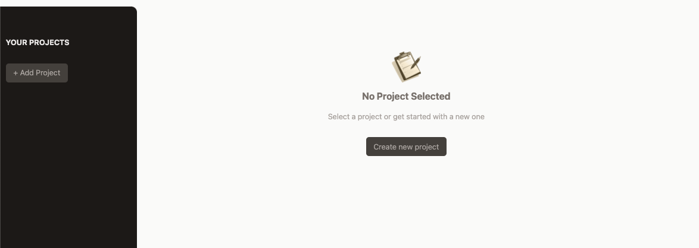
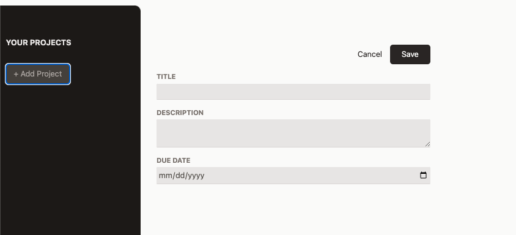
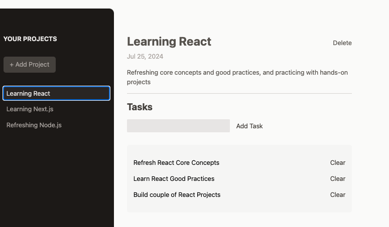

# App Overview

The app is a basic project management tool that allows user to create projects then add tasks to each project. User can select an existing project to show all its tasks. User can also delete tasks and projects as well.

- Live site (hosted with Firebase): https://project-mgmnt-reactjs-7c015.web.app/

 

 

## User Story

- A project manager needs a small project management tool to note down all their projects with due dates and add tasks to each project.

## Techniques applied

- Handling user input by using Refs instead of the 2-way binding technique
- Handling user input by using the 2-way binding technique
- Validating user input and showing modal on user input error
- Managing state using useState() hook
- Handling props drilling
- Manipulating state using array.filter(), array.find() and avoiding object mutation
- Forwarding refs, forwardRef(), to custom components
- Using "Portals", createPortal(), to inject JSX to a specific HTML element
- Exposing component APIs via the useImperativeHandle() Hook
- Dynamically outputting list data using Array.map() method
- Dynamically styling CSS using Tailwind CSS

## Technologies Used

- React
- JavaScript
- HTML 5
- Tailwind CSS

Note: I coded along while following React course by Academind @ https://github.com/academind
